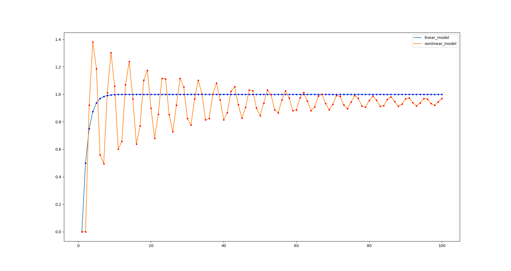

<p align="center"> Министерство образования Республики Беларусь</p>
<p align="center">Учреждение образования</p>
<p align="center">“Брестский Государственный технический университет”</p>
<p align="center">Кафедра ИИТ</p>
<br><br><br><br><br><br><br>
<p align="center">Лабораторная работа №1</p>
<p align="center">По дисциплине “Общая теория интеллектуальных систем”</p>
<p align="center">Тема: “Моделирования температуры объекта”</p>
<br><br><br><br><br>
<p align="right">Выполнил:</p>
<p align="right">Студент 2 курса</p>
<p align="right">Группы ИИ-21</p>
<p align="right">Кирилович А. А.</p>
<p align="right">Проверил:</p>
<p align="right">Иванюк Д. С.</p>
<br><br><br><br><br>
<p align="center">Брест 2022</p>

---

# Общее задание #
1. Написать отчет по выполненной лабораторной работе №1 в .md формате (readme.md) и с помощью запроса на внесение изменений (**pull request**) разместить его в следующем каталоге: **trunk\ii0xxyy\task_01\doc** (где **xx** - номер группы, **yy** - номер студента, например **ii02102**).
2. Исходный код написанной программы разместить в каталоге: **trunk\ii0xxyy\task_01\src**.

## Task 1. Modeling controlled object ##
Let's get some object to be controlled. We want to control its temperature, which can be described by this differential equation:

$$\Large\frac{dy(\tau)}{d\tau}=\frac{u(\tau)}{C}+\frac{Y_0-y(\tau)}{RC} $$ (1)

where $\tau$ – time; $y(\tau)$ – input temperature; $u(\tau)$ – input warm; $Y_0$ – room temperature; $C,RC$ – some constants.

After transformation we get these linear (2) and nonlinear (3) models:

$$\Large y_{\tau+1}=ay_{\tau}+bu_{\tau}$$ (2)
$$\Large y_{\tau+1}=ay_{\tau}-by_{\tau-1}^2+cu_{\tau}+d\sin(u_{\tau-1})$$ (3)

where $\tau$ – time discrete moments ($1,2,3{\dots}n$); $a,b,c,d$ – some constants.

Task is to write program (**Julia**), which simulates this object temperature.

---

# Выполнение задания #

Код программы:
```Julia
    using PyPlot

    y_lin = [] # empty list to store the y values for the linear model
    y_nonlin = [] # empty list to store the y values for the nonlinear model

    function linear_model(a, b, y, u, i, t)
        # if you want to make the noise, pass the (u) parameter as (u + rand(-1:1) / 100)
        if i <= t
            println(y)
            push!(y_lin, y)
            linear_model(a, b, a*y + b*u, u, i + 1, t) 
        else
            println("OFF")
        end
    end

    function nonlinear_model(a, b, c, d, y, y_prev, u, u_prev, i, t)
        # if you want to make the noise, pass the (u) parameter as (u + rand(-1:1) / 100)
        if i == 1
            println(y)
            push!(y_nonlin, y)
            nonlinear_model(a, b, c, d, 
                            a*y - b*y_prev^2 + c*0 + d*sin(0), y, 
                            u, u,
                            i + 1, t)
        elseif i <= t
            println(y)
            push!(y_nonlin, y)
            nonlinear_model(a, b, c, d,
                            a*y - b*y_prev^2 + c*u + d*sin(u_prev), y,
                            u, u, 
                            i + 1, t)
        else
            println("OFF")
        end
    end

    function main()
        i = 1 # initial time; can not be changed
        y = 0.0 # initial temperature; can be changed
        u = 1.0 # input warm; can be changed
        t = 10 # final time; can be changed
        a = 0.5 # linear and nonlinear model parameter; can be changed
        b = 0.5 # linear and nonlinear model parameter; can be changed
        c = 0.5 # nonlinear model parameter; can be changed
        d = 0.5 # nonlinear model parameter; can be changed

        println("Linear Model:")
        linear_model(a, b, y, u, i, t)
        println("Nonlinear Model:")
        nonlinear_model(a, b, c, d, y, y, u, u, i, t)

        x = 1:t; y = y_lin; y2 = y_nonlin
        plot(x, y, label="linear_model")
        plot(x, y2, label="nonlinear_model")
        plot(x, y, "b.") 
        plot(x, y2, "r.")
        legend()
    end

    main()
```     

Вывод программы:

    Linear Model
    0.0
    0.5
    0.75
    0.875
    0.9375
    0.96875
    0.984375
    0.9921875
    0.99609375
    0.998046875
    0.9990234375
    OFF
    Nonlinear Model
    0.0
    0.9207354924039483
    0.4603677462019741
    0.7270424420187648
    1.178287482541788
    1.2455838774265378
    0.849346735359885
    0.5696692622314266
    0.8448751850864142
    1.1809115507815064
    1.1542842286073003
    OFF

