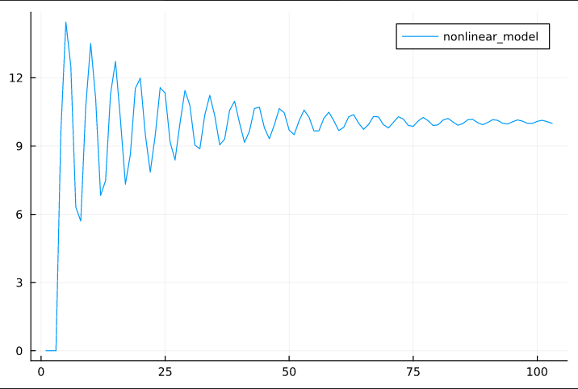

<p align="center"> Министерство образования Республики Беларусь</p>
<p align="center">Учреждение образования</p>
<p align="center">“Брестский Государственный технический университет”</p>
<p align="center">Кафедра ИИТ</p>
<br><br><br><br><br><br><br>
<p align="center">Лабораторная работа №2</p>
<p align="center">По дисциплине “Общая теория интеллектуальных систем”</p>
<p align="center">Тема: “ПИД-регуляторы”</p>
<br><br><br><br><br>
<p align="right">Выполнил:</p>
<p align="right">Студент 2 курса</p>
<p align="right">Группы ИИ-21</p>
<p align="right">Кирилович А. А.</p>
<p align="right">Проверил:</p>
<p align="right">Иванюк Д. С.</p>
<br><br><br><br><br>
<p align="center">Брест 2022</p>

---

# Общее задание #
1. Написать отчет по выполненной лабораторной работе №1 в .md формате (readme.md) и с помощью запроса на внесение изменений (**pull request**) разместить его в следующем каталоге: **trunk\ii0xxyy\task_02\doc** (где **xx** - номер группы, **yy** - номер студента, например **ii02102**).
2. Исходный код написанной программы разместить в каталоге: **trunk\ii0xxyy\task_02\src**.

# Задание #
На Julia реализовать программу, моделирующую рассмотренный выше ПИД-регулятор.  В качестве объекта управления использовать математическую модель, полученную в предыдущей работе.
В отчете также привести графики для разных заданий температуры объекта, пояснить полученные результаты.

---

# Выполнение задания #

Код программы:
```Julia
    using Plots
    using LinearAlgebra

    K = 0.0001
    T = 100
    T_D = 100
    T_0 = 1

    q_0 = K * (1 + T_D/T_0)
    q_1 = -K * (1 + 2 * T_D / T_0 - T_0 / T)
    q_2 = K * T_D / T_0

    q = [q_0, q_1, q_2]
    e = [0.0, 0.0, 0.0]
    y = [0.0, 0.0, 0.0]
    u = [1.0, 1.0]

    function nonlinear_model(time, a = 0.5, b = 0.3, c = 0.9, d     = 0.7)
        i = 0
        while i < time
            e[1] = w - y[length(y)]
            e[2] = w - y[length(y) - 1]
            e[3] = w - y[length(y) - 2]
            u[1] = u[2] + dot(q, e)
            push!(y, (a*y[length(y)] - b*y[length(y) - 1]^2 +   c*u[1] + d*sin(u[2])))
            u[2] = u[1]

            i += 1
        end
    end

    function main()
        global w = parse(Int64, readline())
        nonlinear_model(100)

        for el in y
            println(el * w / y[length(y)])  
        end

        plot(1:length(y), y * w / y[length(y)],     label="nonlinear_model")
    end

    main()
```     

Вывод программы:

    0.0
    0.0
    0.0
    9.69140581303558
    14.449097032902666
    12.505277323667597
    6.318736882385786
    5.704833796489725
    10.73183301628717
    13.513535520540419
    11.094195656604356
    6.831378548074819
    7.480944261478211
    11.290776203159307
    12.71993436830598
    10.147240033233507
    7.324509676566069
    8.642628326039585
    11.538664676655939
    11.986498761095012
    ...
    10.14942655058238
    10.099062772982727
    9.998275633418178
    9.995925139904656
    10.08749381353281
    10.13428947400506
    10.073031372947419
    10.0

---

